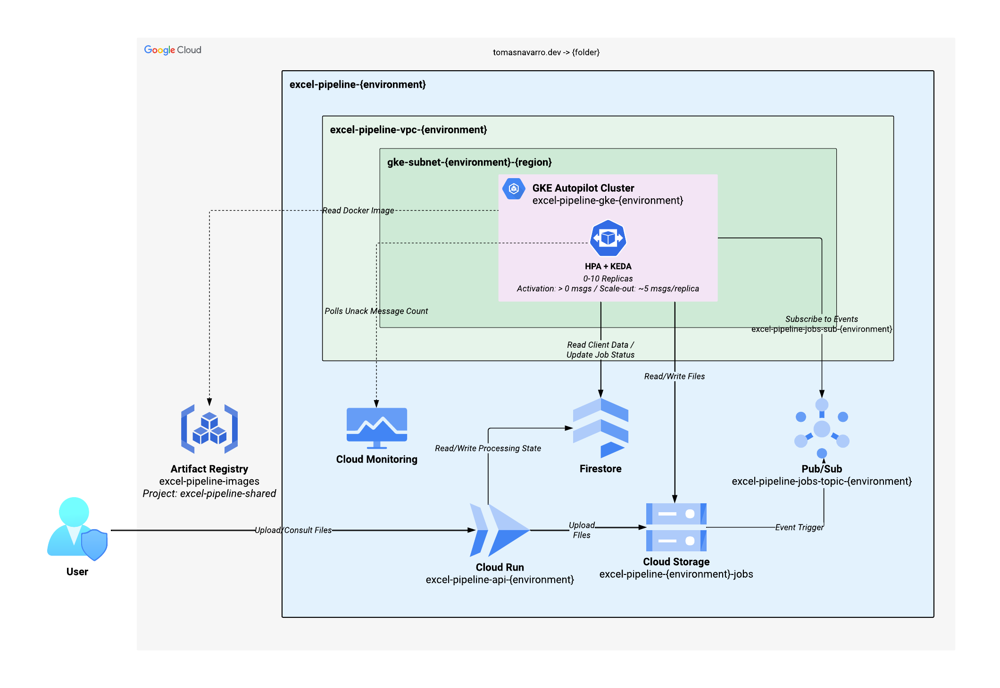

# excel-processing-pipeline-gke

> 🚧 **Active development.** This repository is being built and documented
> incrementally, in public — infrastructure, application code, and docs land
> as they're actually finished, not all at once. See [Status](#-status) below
> for what's live today and what's next.

## 📖 Overview

An asynchronous Excel file processing pipeline on Google Cloud:

- A **FastAPI** API, deployed on **Cloud Run**, receives a file, validates
  it, uploads it to **GCS**, and writes a status record to **Firestore**
  (keyed by `job_id`).
- GCS natively notifies **Pub/Sub** when the upload finishes
  (`OBJECT_FINALIZE`) — the API never publishes the event itself, to avoid a
  dual-write.
- A **worker on GKE** consumes the event, processes the file, writes the
  result back to GCS, and updates the job status — scaling event-driven via
  **KEDA**, down to 0 replicas at rest, instead of an always-on pod.
- Dev and prod are fully separate GCP projects (isolated IAM, quotas, and
  billing), each under its own Folder in a Cloud Identity organization.
- Infrastructure is managed with **HCP Terraform**, authenticating to GCP
  via **Workload Identity Federation** — no static service account keys
  anywhere in the pipeline.

---

## 🧭 Background

This project is inspired by a real tool I designed and built: a Python +
PyQt5 program that splits a merged customer spreadsheet into one file per
customer, with correct headers and filenames, ready to email out
individually. Some publishers send data for up to 60 customers mixed into a
single file; a VBA post-processing step handles a legacy `.xls` export
format one client still requires.

It's in active use across 16 recurring publishers. Manual segmentation used
to take 1–1.5 hours per publisher (~20 hours total); the tool now does each
in under a minute (~20 minutes total).

This repository is not a 1:1 port of it — it's a reconstruction of the same
underlying business problem (splitting and routing a shared file to many
distinct recipients) on a cloud-native stack (GCP, Kubernetes, event-driven
architecture, Terraform), built to explore how that problem scales and to
demonstrate an infrastructure approach, not to replace the original system.

---

## 🏗️ Architecture



Diagrams follow the conventions in [`docs/architecture/style-guide.md`](docs/architecture/style-guide.md).

### Platform foundation


Kept as Markdown rather than a diagram image on purpose — this tree
changes every time a domain or workspace is added (most recently
`gke-addons`), and a static image goes stale faster than it's worth
re-exporting each time.

#### GCP resource hierarchy

```
tomasnavarro.dev (Organization)
├── development (Folder)
│   └── excel-pipeline-dev (Project)
├── production (Folder)
│   └── excel-pipeline-prod (Project)
├── bootstrap (Folder)
│   └── excel-pipeline-seed (Project)
└── shared (Folder)
    └── excel-pipeline-shared (Project)
```

#### HCP Terraform resource hierarchy

A separate hierarchy from the one above — an HCP Terraform "Project" is an
organizational concept for grouping workspaces, unrelated to a GCP Project.

```
<hcp-terraform-org> (Organization)
├── excel-processing-pipeline-gke-dev (Project)
│   ├── excel-pipeline-networking-dev (Workspace)
│   ├── excel-pipeline-gke-dev (Workspace)
│   ├── excel-pipeline-gke-addons-dev (Workspace)
│   ├── excel-pipeline-data-dev (Workspace)
│   └── excel-pipeline-cloud-run-dev (Workspace)
├── excel-processing-pipeline-gke-prod (Project)
│   ├── excel-pipeline-networking-prod (Workspace)
│   ├── excel-pipeline-gke-prod (Workspace)
│   ├── excel-pipeline-gke-addons-prod (Workspace)
│   ├── excel-pipeline-data-prod (Workspace)
│   └── excel-pipeline-cloud-run-prod (Workspace)
├── excel-processing-pipeline-gke-shared (Project)
│   └── excel-pipeline-registry-shared (Workspace)
└── excel-processing-pipeline-gke-mgmt (Project)
    ├── excel-pipeline-hcp-mgmt (Workspace)
    └── excel-pipeline-governance-mgmt (Workspace)
```

Each GCP project's Workload Identity Federation trust is scoped to
exactly the HCP Terraform workspaces that need it: `excel-pipeline-seed`
trusts only the `governance-mgmt` workspace specifically (`hcp-mgmt` has
no GCP access at all), while `dev`/`prod`/`shared` each trust every
workspace inside their respective HCP Terraform project, since those
domain workspaces share one per-project deployer identity (see
`terraform/platform/governance/wif.tf`).

---

## ✅ Status

### Done

- [x] Architecture defined; repo structure and GCP/HCP Terraform naming
      conventions established.
- [x] `terraform/platform/hcp/`: creates the `dev`/`prod`/`shared` HCP
      Terraform projects and their workspaces (8 domain workspaces plus
      `registry-shared`) via `for_each`, connects them to a custom GitHub
      OAuth connection, and drives it all from a manually bootstrapped
      management workspace.
- [x] GCP organization set up under a Cloud Identity Free domain; the
      `bootstrap` folder and seed project created, with their own Workload
      Identity Pool/Provider and service account for governance's auth.
- [x] `terraform/platform/governance/`: creates the `development`/
      `production`/`shared` folders and their GCP projects, the 12 Cloud
      Identity groups (split by environment where needed, plus
      `registry-admins@`/`ci-cd-pipelines@`), project-level IAM for
      `infra-admins`/`registry-admins`/`keda-operators`, and a per-project
      Workload Identity Pool/Provider/service account — including
      `shared` — for the domain workspaces to use.
- [x] IAM groups/roles reference table and diagramming style guide.
- [x] Architecture diagram.
- [x] `terraform/domains/networking`: VPC, GKE node subnet, and pod/service
      secondary IP ranges for dev/prod, via
      `terraform-google-modules/network`.
- [x] `terraform/domains/gke` (dev): a hand-written `google_container_cluster`
      in Autopilot mode, factored into the reusable
      `terraform/modules/gke-autopilot` module (not the official one —
      deliberate, see the devlog), reached only via a DNS-based control
      plane endpoint (no bastion, no `master_authorized_networks`).
      `worker-gke-sa`/`keda-operator-sa`, their group memberships, and
      their Workload Identity bindings applied successfully on a real
      apply.
- [x] `terraform/domains/gke-addons` (dev workspace created; `data
      "google_container_cluster"` looks the cluster up by name, not
      `tfe_outputs`): installs KEDA via Helm, in its own workspace — the
      `kubernetes`/`helm` providers can't safely be configured from a
      resource created in the same apply (see the devlog).
- [x] CI: GitHub Actions running `terraform fmt`/`validate`/`tflint` on
      every push touching `terraform/`, no GCP/HCP credentials involved.

### In progress (as of 2026-09-30)

- [ ] `gke-addons`: KEDA's Helm install and its Workload Identity
      annotation haven't been confirmed on a clean end-to-end apply yet.
      The `ScaledObject`/`TriggerAuthentication` and the worker's own KSA
      are Kustomize's, not written yet.
- [ ] Mirroring `gke`/`gke-addons`/`networking` into `prod` (`dev` only so
      far).

### Next steps

- [ ] `terraform/domains/registry/shared`: the Artifact Registry repo, the
      Cloud Build ↔ GitHub connection (2nd-gen), and build triggers.
- [ ] Resource-scoped IAM bindings (`gke-workloads`, `app-runtime`,
      `api-invokers`, `ci-cd-pipelines` roles), attached by each domain as
      it creates its own resources.
- [ ] `terraform/domains/{data,cloud-run}` implementation (currently
      scaffolded, not yet implemented).
- [ ] The FastAPI API and the GKE worker's own application code.
- [ ] Kustomize manifests for the worker's `Deployment`/`ScaledObject`/KSA.

A detailed, chronological log of decisions and problems solved along the way
lives in [`docs/devlog/bitacora.md`](docs/devlog/bitacora.md) (in Spanish).

---

## 🛠️ Tech stack


Google Cloud (Cloud Run, GKE Autopilot, Firestore, GCS, Pub/Sub, Cloud
Monitoring, Cloud Identity/IAM) · Terraform + HCP Terraform · KEDA · Helm ·
FastAPI · Docker · Kustomize
